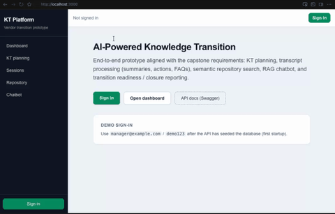

# AI-Powered Knowledge Transition Platform

Open-source style monorepo for a **knowledge transition (KT) automation** prototype: structured sessions, document repository, optional **LLM-assisted** summarization and RAG chat, and a dashboard aligned with typical KT program requirements.

**Repository:** [github.com/sanjeevstv/AI-Powered-Knowledge-Transition-app](https://github.com/sanjeevstv/AI-Powered-Knowledge-Transition-app)

**This repo does not contain API keys, JWT secrets, or environment-specific URLs.** Copy [`.env.example`](.env.example) to `.env`, fill in your own values locally, and never commit `.env`, `apps/api/.env`, or `apps/web/.env.local`. The [`docs/publish-checklist.md`](docs/publish-checklist.md) summarizes security and publishing notes.

---

## What it does

- **Role-aware UI (RBAC via `role_config`)** — After login, [`data/role_config.json`](data/role_config.json) maps email addresses to **Manager**, **SME**, or **Vendor** (including legacy aliases). That drives **full** vs **limited** UI: full users get the complete left nav (including KT Planning and creating sessions); limited users keep repository and chat but not planning/session creation. Restart the API after editing the JSON so `GET /auth/me` reflects changes.
- **AI is optional** — With no `OPENAI_API_KEY`, the API uses deterministic stubs for demos (summaries, FAQs, chat, pseudo-embeddings). With a key (and optional `OPENAI_BASE_URL` for OpenAI-compatible gateways), you get live LLM calls and real embeddings when configured.
- **Demo accounts** — Seeded users use password `demo123` (see Quick start). Align emails with `role_config.json` for the UI you expect.

---

## Demo



*(~2 MB GIF; regenerate from a screen recording with `python scripts/mov_to_readme_gif.py <input.mov> docs/kt-app-demo.gif` — keep source `.mov` files out of git; see `.gitignore`.)*

---

## Documentation map

| Doc | Purpose |
|-----|---------|
| [`docs/technical-design.md`](docs/technical-design.md) | Architecture, data model, auth/JWT, AI/RAG pipeline, API surface |
| [`setup_guide.md`](setup_guide.md) | Detailed local and Docker setup, env loading order, troubleshooting |
| [`docs/publish-checklist.md`](docs/publish-checklist.md) | Security/CORS/JWT/RBAC review summary and pre-publish checks |
| [`scripts/push_github_pat.sh`](scripts/push_github_pat.sh) | Optional: push with a PAT file (gitignored **`.github_pat`**); use **`--force`** after a history rewrite |
| [`docs/deliverables.md`](docs/deliverables.md) | Submission-style checklist |

---

## Tech stack

| Layer | Technologies |
|-------|----------------|
| **Web** | Next.js 14, React 18, TypeScript, Tailwind CSS |
| **API** | FastAPI, SQLModel, SQLite (default), Uvicorn |
| **AI / search** | OpenAI-compatible client (optional), Chroma vector store, RAG chat |
| **Auth** | JWT (HS256), bcrypt password hashes |
| **Config** | Pydantic Settings, `.env` at repo root (+ optional `apps/api/.env`) |

Public npm registry is pinned via [`apps/web/.npmrc`](apps/web/.npmrc) so `package-lock.json` stays portable.

---

## Prerequisites

- **Node.js** 18+ (20+ recommended for some ESLint dependency engines)
- **Python** 3.11+ (see `apps/api/pyproject.toml`)
- **Docker** (optional) for `docker compose up`

---

## Quick start (local)

### 1. Environment

```bash
cp .env.example .env
# Optionally tune secrets: set JWT_SECRET (32+ random bytes) for non-dev deploys.
# Set OPENAI_API_KEY (and OPENAI_BASE_URL if needed) for live AI; omit for stub mode.
```

[`setup_guide.md`](setup_guide.md) describes how the API loads env files and [`apps/web/.env.example`](apps/web/.env.example) for `NEXT_PUBLIC_API_URL`.

### 2. API

```bash
cd apps/api
python3 -m venv .venv
source .venv/bin/activate   # Windows: .venv\Scripts\activate
pip install -e .
uvicorn app.main:app --reload --host 0.0.0.0 --port 8000
```

- OpenAPI: http://localhost:8000/docs  
- Health: http://localhost:8000/api/v1/health  

### 3. Web

```bash
cd apps/web
cp .env.example .env.local   # optional; defaults to http://localhost:8000
npm install
npm run dev
```

Open http://localhost:3000 — main routes: `/login`, `/dashboard`, `/planning`, `/sessions`, `/repository`, `/chat`. See [`data/role_config.json`](data/role_config.json) for who sees which navigation.

**Sample logins** (password `demo123`): `manager@example.com`, `sme@example.com`, `vendor@example.com`, `usera@example.com`, `userb@example.com`.

---

## Docker

From the repository root (pass secrets via your shell or an ignored env file — not committed):

```bash
docker compose up --build
```

Set `JWT_SECRET` and optionally `OPENAI_API_KEY` / `OPENAI_BASE_URL` in the environment before `docker compose` so containers do not rely on placeholder defaults in production.

---

## Environment variables (names only)

Values belong in **local** `.env` / `apps/web/.env.local` only. See [`.env.example`](.env.example) for descriptions.

| Variable | Component |
|----------|-----------|
| `DATABASE_URL` | API |
| `OPENAI_API_KEY` | API (optional) |
| `OPENAI_BASE_URL` | API (optional) |
| `OPENAI_MODEL` | API |
| `OPENAI_EMBEDDING_MODEL` | API |
| `OPENAI_USE_PSEUDO_EMBEDDINGS` | API |
| `CHROMA_PERSIST_DIR` | API |
| `DATA_UPLOAD_DIR` | API |
| `EXPECTED_DOCUMENTS` | API |
| `CORS_ORIGINS` | API |
| `JWT_SECRET` | API |
| `JWT_EXPIRE_MINUTES` | API (if set) |
| `NEXT_PUBLIC_API_URL` | Web |

---

## Repository layout

| Path | Purpose |
|------|---------|
| `apps/web/` | Next.js frontend |
| `apps/api/` | FastAPI backend |
| `data/samples/` | Seed JSON/text for sessions and assessments |
| `data/role_config.json` | Email → UI role mapping (RBAC for nav and actions) |
| `docs/` | Design docs, deliverables, demo GIF |

---

## License / usage

Treat this as a demo/educational codebase. Harden JWT secrets, CORS, and dependency updates before any production deployment — see [`docs/publish-checklist.md`](docs/publish-checklist.md).
