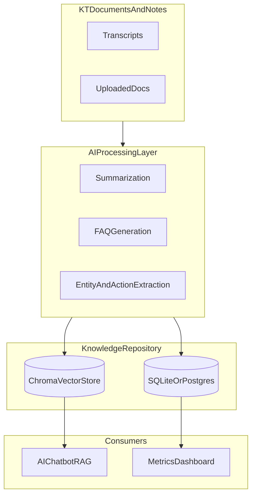
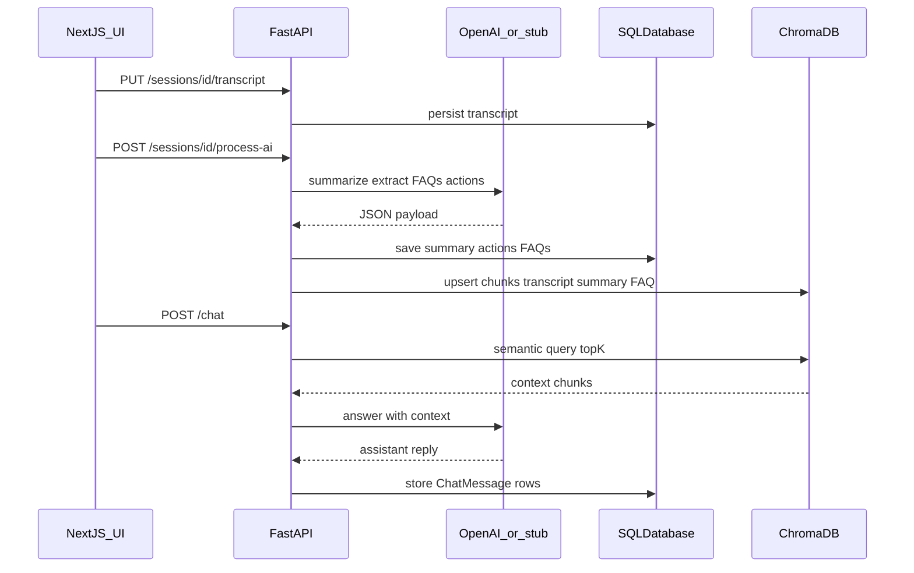

# Architecture — AI-Powered KT Automation Platform

This document maps the implementation to the capstone requirements (`AI-Powered Knowledge Transition .docx`, repository root).

## High-level diagram (requirements Section 8)

## Request flow: upload to answer

## Module mapping (requirements Sections 7 and 11)

| Requirement module | Code location | Notes |
|--------------------|---------------|-------|
| User management (roles) | [apps/api/app/routers/auth.py](../apps/api/app/routers/auth.py), [apps/api/app/db/models.py](../apps/api/app/db/models.py) | JWT bearer; roles `transition_manager`, `sme`, `vendor_team_member` |
| KT session management | [apps/api/app/routers/sessions.py](../apps/api/app/routers/sessions.py) | CRUD, transcript upload, completion on AI process |
| AI processing engine | [apps/api/app/services/llm.py](../apps/api/app/services/llm.py), `POST .../process-ai` | Summaries, action items, FAQs, missing-knowledge string |
| Knowledge repository | [apps/api/app/routers/documents.py](../apps/api/app/routers/documents.py), [apps/api/app/services/rag.py](../apps/api/app/services/rag.py) | `.txt` / `.pdf` upload, Chroma semantic index |
| AI chatbot (RAG) | [apps/api/app/routers/chat.py](../apps/api/app/routers/chat.py) | Retrieval then grounded generation (or stub) |
| Transition dashboard | [apps/api/app/routers/dashboard.py](../apps/api/app/routers/dashboard.py) | KPIs and readiness score |

## Chroma indexing contract (prep / RAG)

Indexed **documents** (metadata on each chunk):

| Field | Description |
|-------|-------------|
| `source_type` | `"kt_session"` or `"document"` |
| `chunk_kind` | `"transcript"`, `"summary"`, `"faq"`, or `"body"` |
| `session_id` | String DB id when `source_type=kt_session` |
| `external_id` | Business KT id (e.g. `KT-101`) for session-derived chunks |
| `document_id` | String DB id when `source_type=document` |
| `filename` | Original filename for document chunks |

**Embedding behavior**

- If `OPENAI_API_KEY` is set: OpenAI embeddings (`OPENAI_EMBEDDING_MODEL`, default `text-embedding-3-small`).
- Otherwise: deterministic pseudo-embeddings (hash-expanded vectors) so local demos work without external calls.

Chunks are sized ~1200 characters with overlap (see `chunk_text` in `rag.py`).

## Chat RAG contract

- **Endpoint:** `POST /api/v1/chat`  
- **Body:** `{ "message": string }`  
- **Behavior:** Embed query (or pseudo-embed), `n_results=5` against collection `kt_knowledge`, concatenate chunks, call LLM with “context-only” system prompt (or stub echo).  
- **Persistence:** Inserts two rows in `ChatMessage` (`user`, then `assistant`) for dashboard KPIs.

## Readiness score API (requirements Section 10.D)

- **Endpoint:** `GET /api/v1/dashboard/summary` (requires bearer token).

**Inputs (from SQL)**

- KT completion %: completed sessions / total sessions × 100.  
- Assessment score: average of `AssessmentResult.quiz_score`.  
- Document coverage %: `documents / EXPECTED_DOCUMENTS × 100` capped at 100 (`EXPECTED_DOCUMENTS` from env, default 10).  
- Question resolution rate %: `assistant` chat messages / `user` chat messages × 100 (capped); if no user messages, defaults to 80 for a neutral bootstrap.

**Formula**

`readiness = 0.30 * kt_completion + 0.30 * assessment_avg + 0.20 * doc_coverage + 0.20 * qa_rate`

All components are 0–100 scales.

## Vertical slice: transcript to AI artifacts

| Step | HTTP | Description |
|------|------|-------------|
| 1 | `POST /api/v1/sessions` | Create session with `external_id`, `topic`, optional `owner_id`. |
| 2 | `PUT /api/v1/sessions/{id}/transcript` | Store raw transcript / notes text. |
| 3 | `POST /api/v1/sessions/{id}/process-ai` | LLM JSON: summary, decisions, risks, action items, FAQs; replaces prior actions/FAQs for that session; marks session completed; indexes Chroma. |

When `OPENAI_API_KEY` is unset, `llm.py` returns structured **stubs** derived from keywords (Jenkins, Splunk, rollback, etc.) so Week 1 UI work is unblocked.

## Additional HTTP contracts (UI-aligned)

| Endpoint | Role |
|----------|------|
| `GET /api/v1/auth/users` | List users for assigning KT session owners (Module 1 / planning). |
| `GET /api/v1/search/semantic?q=` | Semantic search hits over Chroma (Module 4). |
| `GET /api/v1/dashboard/closure-report` | Narrative + checklist vs illustrative thresholds (§16–17). |
| `PATCH /api/v1/sessions/{id}/action-items/{itemId}` | Toggle action item completion (progress tracking). |

## Suggested enhancements (out of scope for prep)

Enterprise SSO, multi-tenant isolation, streaming STT, production hardening — see requirements Section 7 (Out of Scope).
