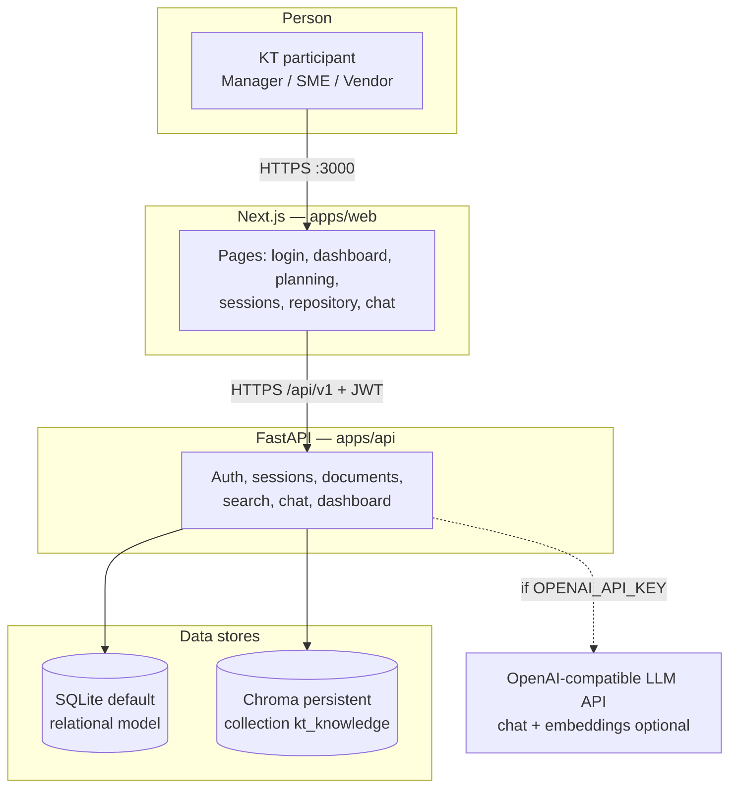
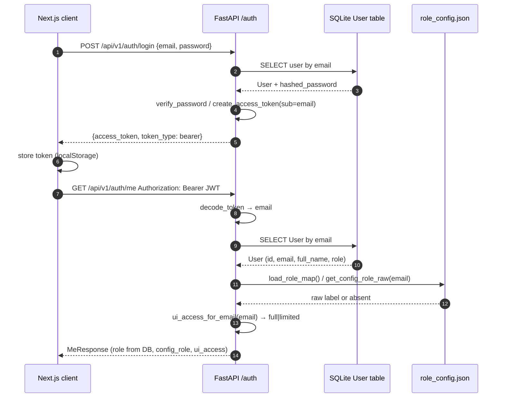

# Technical design — KT automation platform

Engineering reference for onboarding: how the Next.js UI, FastAPI service, SQLite, Chroma, and optional OpenAI-compatible LLMs fit together. Complements [architecture.md](./architecture.md) (requirements mapping, KPI formulas) and the root [README](../README.md).

---

## 1. System context and high-level architecture

The product is a **monorepo**: `apps/web` (Next.js 14) talks to `apps/api` (FastAPI) over HTTPS from the browser. The API persists relational data in **SQLite** by default (`DATABASE_URL`), loads **UI access rules** from repo-local **`data/role_config.json`** at request time (via `load_role_map()`), and stores/embeds knowledge chunks in **Chroma** (`CHROMA_PERSIST_DIR`, collection `kt_knowledge`). **Optional** outbound calls go to an **OpenAI-compatible** HTTP API for chat completions and (unless disabled) embeddings.



*C4-style context view:* one actor, two software systems (UI / API), two data stores, one external system. All boundaries map to concrete repo paths above.

**ASCII (deployment-shaped view)**

```
  Browser (localhost:3000)
       |
       |  fetch /api/v1/* + Authorization: Bearer <JWT>
       v
  FastAPI (localhost:8000)
       |-- SQLite (kt_platform.db default)
       |-- Chroma persistent dir (./chroma_data)
       '-- OpenAI-compatible base URL (optional)
```

---

## 2. Sequence: login, `/auth/me`, and RBAC from `role_config.json`

Authentication uses **JWT** (HS256 by default): `sub` claim is the user’s **email**. Passwords are **bcrypt**-hashed in `User.hashed_password`.

**RBAC split:**

| Concern | Source of truth | Effect |
|--------|------------------|--------|
| **Who can sign in** | `User` row in SQLite | Login compares email + password |
| **`role` on API responses / registration** | `User.role` enum in DB | Stored at register time; exposed on `/auth/me` as `role` |
| **`ui_access` (`full` vs `limited`)** | **`data/role_config.json`** (email → label) | Computed in `ui_access_for_email()`; drives UI and `require_full_ui_access` |
| **Privileged API actions** (e.g. create session, list users for owner picker) | **`require_full_ui_access`** | Same file-derived rule: only `transition_manager` / `sme` after canonicalizing the JSON value |

Missing or unmapped emails in `role_config.json` resolve to **vendor_team_member** + **`limited`** access. **Restart the API** after editing the JSON so in-memory reads pick up changes (no hot reload of the file in code).



---

## 3. Sequence: KT session “Run AI” (transcript → LLM → DB → Chroma)

Typical flow: **save transcript** (`PUT /sessions/{id}/transcript`), then **Run AI** (`POST /sessions/{id}/process-ai`). The handler replaces prior **`ActionItem`** and **`FAQItem`** rows for that session, updates **`KTSession`** summary fields, sets status **`completed`**, then **upserts** transcript/summary/FAQ chunks into Chroma via `index_session_content()`.

```mermaid
sequenceDiagram
    autonumber
    participant W as Next.js
    participant API as FastAPI /sessions
    participant DB as SQLite
    participant LLM as llm.process_kt_transcript
    participant RAG as rag.index_session_content
    participant CH as Chroma kt_knowledge

    W->>API: POST /api/v1/sessions/{id}/process-ai (Bearer)
    API->>DB: load KTSession; fail if transcript empty
    API->>LLM: process_kt_transcript(transcript)
    alt OPENAI_API_KEY nonempty
        LLM->>LLM: OpenAI chat.completions JSON object
        LLM->>LLM: _parse_llm_json_object (strip fenced code if present)
    else no key
        LLM->>LLM: _stub_process(keyword heuristics)
    end
    LLM-->>API: dict summary, decisions, risks, actions, faqs, gaps
    API->>DB: DELETE old ActionItem, FAQItem for session
    API->>DB: UPDATE KTSession fields; INSERT new ActionItem, FAQItem
    API->>RAG: index_session_content(session id, external_id, text...)
    RAG->>RAG: chunk_text; embed_texts (OpenAI or pseudo)
    RAG->>CH: collection.upsert(ids, documents, metadatas, embeddings)
    API-->>W: ProcessAIResponse (counts, indexed_in_vector_store)
```

---

## 4. API surface (`/api/v1`)

All routers are mounted under **`/api/v1`** in `apps/api/app/main.py`. Selected endpoints:

| Prefix | Auth | Purpose |
|--------|------|---------|
| `GET /health` | No | Liveness |
| `/auth/login`, `/auth/register` | No / No | JWT issuance; user creation |
| `/auth/me` | Bearer | Current user + **`config_role`**, **`ui_access`** |
| `/auth/users` | Bearer + **full UI** | User list (owner assignment) |
| `/sessions` | Bearer | List sessions; **POST** requires full UI |
| `/sessions/{id}` | Bearer | Detail + nested action items / FAQs |
| `/sessions/{id}/transcript` | Bearer | Replace transcript text |
| `/sessions/{id}/process-ai` | Bearer | LLM/stub → SQL → Chroma index |
| `/sessions/.../action-items/...` | Bearer | Toggle `is_done` |
| `/documents` | Bearer | List / **multipart upload** (txt, pdf) → extract text → Chroma |
| `GET /search/semantic?q=` | Bearer | Semantic hits via `retrieve_context` |
| `POST /chat` | Optional Bearer (`get_current_user_optional`) | RAG answer; persists `ChatMessage` |
| `/dashboard/summary`, `/dashboard/closure-report` | Bearer | KPIs + narrative checklist |

OpenAPI: `/docs` on the API host.

---

## 5. Frontend (Next.js)

### 5.1 App routes

| Route | Role in product |
|-------|------------------|
| `/` | Entry / landing behavior per `page.tsx` |
| `/login` | Credentials → `POST /auth/login` → token |
| `/dashboard` | Readiness KPIs, closure report |
| `/planning` | Phase-1 planning UI |
| `/sessions`, `/sessions/[id]` | List/detail, transcript, **Run AI**, action items |
| `/repository` | Document upload, semantic search |
| `/chat` | RAG chat |

`Root` layout wraps children in **`AppShell`** (`apps/web/src/app/layout.tsx`).

### 5.2 `AuthProvider` / `AppShell` / `Nav`

- **`AppShell`**: Renders **`AuthProvider`** → sidebar **`Nav`** + **`AppHeader`** + page content.
- **`AuthProvider`**: On non-login paths, if a token exists, calls **`GET /api/v1/auth/me`** and exposes `me`, `loading`, `refreshMe`.
- **`Nav`**: Hidden on `/login`. Uses **`me.ui_access`** to filter links: **`limited`** users do not see **KT planning** (`/planning`).
- **`AppHeader`**: Shows email from `me`; sign out clears token and routes to login.

**`ui_access` (full vs limited) — UI behavior**

| Access | Navigation | Sessions page |
|--------|------------|---------------|
| **full** | All links including KT planning | **Create session** form + **`GET /auth/users`** for owner dropdown |
| **limited** | No `/planning` link | List and detail still available; **no** create form / user fetch for owners |

API enforcement mirrors this: **`POST /sessions`** and **`GET /auth/users`** use **`require_full_ui_access`**, not merely “any authenticated user.”

---

## 6. Data model overview

Implemented in `apps/api/app/db/models.py` (SQLModel tables).

| Entity | Key fields / notes |
|--------|---------------------|
| **`User`** | `email` (unique), `hashed_password`, `full_name`, **`UserRole`** (`transition_manager`, `sme`, `vendor_team_member`) |
| **`KTSession`** | `external_id` (e.g. KT-101), `topic`, `owner_id` → `User`, `status` (`pending`/`completed`), long text: `transcript_text`, `summary_text`, `key_decisions`, `risks`, `missing_knowledge_notes` |
| **`ActionItem`** | `session_id`, `text`, `is_done` |
| **`FAQItem`** | `session_id` and/or `document_id`, `question`, `answer` |
| **`Document`** | Upload metadata, `content_extracted`, `storage_path`, `tags` |
| **`AssessmentResult`** | `user_id`, `quiz_score` (dashboard averages) |
| **`ChatMessage`** | `user_id` optional, `role` (`user`/`assistant`), `content` |

Relationships: `User.sessions_owned`, `KTSession.action_items` / `faq_items`, etc.

---

## 7. AI pipeline (`apps/api/app/services/llm.py` and RAG)

### 7.1 KT processing (`process_kt_transcript`)

- **Stub path**: If `OPENAI_API_KEY` is empty/whitespace, returns **`_stub_process`**: keyword-based action items, two canned FAQs, heuristic “missing knowledge” — suitable for offline demos.
- **Live path**: `AsyncOpenAI` with `OPENAI_BASE_URL` optional; `chat.completions.create` with `response_format={"type": "json_object"}`, model from `OPENAI_MODEL` (default `gpt-4o-mini`). User message caps transcript at **12,000** characters.

### 7.2 JSON and markdown fences

**`_parse_llm_json_object`** strips a leading **` ```json `** … **` ``` `** wrapper if the model returns fenced JSON despite `json_object` mode, then `json.loads`. On failure, the code **logs a warning** and **falls back to stub** processing for that request. Individual fields can still partial-fallback to stub slices (e.g. empty `action_items`).

### 7.3 Chat (`answer_with_context`)

- Without API key: returns a **stub** string echoing the top retrieved chunk snippet (up to ~500 chars).
- With key: system prompt restricts answers to **context-only** when possible.

### 7.4 Embeddings and `OPENAI_USE_PSEUDO_EMBEDDINGS`

Implemented in **`apps/api/app/services/rag.py`**:

| Condition | Embedding behavior |
|-----------|-------------------|
| No `OPENAI_API_KEY` | **`_pseudo_embedding`**: deterministic 384-d vector from SHA-256 + LCG, L2-normalized |
| Key set + **`OPENAI_USE_PSEUDO_EMBEDDINGS=true`** | Same pseudo vectors (documented use case: gateway has chat but not `/v1/embeddings`) |
| Key set + flag **false** | `AsyncOpenAI.embeddings.create` with `OPENAI_EMBEDDING_MODEL` (default `text-embedding-3-small`) |

**Indexing**: `chunk_text` uses ~**1200** characters with **150** overlap. Session chunks get metadata `source_type`, `chunk_kind`, `session_id`, `external_id`; document chunks use `document_id`, `filename`, `chunk_kind: body`.

**Retrieval**: Chat and `GET /search/semantic` call `retrieve_context` with **`n_results`** 5 (chat) or **12** (search UI API).

---

## 8. Security notes

| Topic | Implementation |
|-------|----------------|
| **JWT** | HS256 (default), `JWT_SECRET`, exp from `JWT_EXPIRE_MINUTES`; `sub` = email |
| **CORS** | `CORSMiddleware`; `CORS_ORIGINS` comma list from settings (default `http://localhost:3000`); credentials allowed |
| **Passwords** | bcrypt hash/compare in `deps.py` |
| **`role_config` vs DB `role`** | **`User.role`** is persisted at registration and returned on `/me`; **`ui_access`** and effective “manager/SME vs vendor” for **authorization** derive from **`role_config.json`**, not from DB alone. Misconfiguration: user could have `transition_manager` in DB but **limited** UI if their email is missing or labeled Vendor in JSON — by design the file wins for UI and `require_full_ui_access`. |
| **Chat auth** | `POST /chat` accepts **optional** bearer; messages still persisted with `user_id` when present |

**Operational**: Use a long random `JWT_SECRET` in non-dev environments; treat `OPENAI_API_KEY` as a secret in `.env` only.

---

## 9. Related files (quick index)

| Area | Path |
|------|------|
| App factory, CORS, router mount | `apps/api/app/main.py` |
| Auth routes | `apps/api/app/routers/auth.py` |
| JWT / password / `require_full_ui_access` | `apps/api/app/deps.py` |
| `role_config.json` loading | `apps/api/app/services/role_config.py`, `data/role_config.json` |
| LLM + PDF text | `apps/api/app/services/llm.py` |
| Chroma + embeddings | `apps/api/app/services/rag.py` |
| Settings / env | `apps/api/app/config.py`, `.env.example` |
| Web API client | `apps/web/src/lib/api.ts` |
| Auth + nav | `apps/web/src/components/AuthProvider.tsx`, `Nav.tsx`, `AppShell.tsx`, `AppHeader.tsx` |
